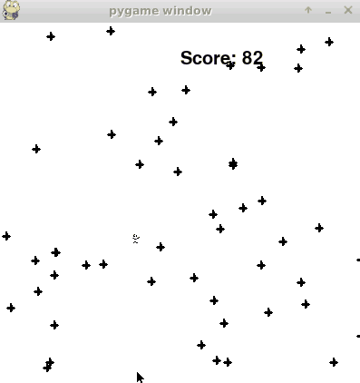

# Gym-Dodge
This repository contains the Dodge as a gym environment



# Implementation
Works in Ubuntu 18.04  
you need to install X11 in linux system.
# Installation
In gym-dodge directory,

you need to type following command

```
pip3 install -e .
```

# Test SAC model

There is env.render() in test.py

To render this game,

You need to type following command
```
DISPLAY=:0 python3 test.py
```


# Version

## Dodge-1.0
Continuous action space, Fixed enemies generation, 50 enemies  

## gym_dodge/envs/dodge_env_10
Default : Continuous action space, Fixed enemies generation, 10 enemies  
Option :  
In render, press  
 Space : Changing enemies generation fixed <-> random  
 Up, Down : Fixed enemies generation seed change

