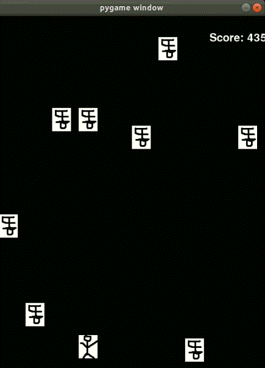

# Gym-AvoidShit <sup id="a1">[1](#footnote1)</sup> <sup id="a2">[2](#footnote1)</sup>
This repository contains the Avoid Shit as a gym environment



# Implementation
Works in Ubuntu 18.04  
you need to install X11 in linux system.
# Installation
In gym-avoidshit directory,

you need to type following command

```
pip3 install -e .
```

# Test DQN model

There is env.render() in test.py

To render this game,

You need to type following command
```
DISPLAY=:0 python3 test.py
```


# Version

## AvoidShit-1.0
Discrete action space , fixed shit generation, Normalization


><b id="footnote1">1. </b> if you want to run Gym-Dodge, change branch master to dodge [↩](#a1)  
><b id="footnote2">2. </b> if you want to run Continuous Gym-avoidshit, change branch master to continuous [↩](#a2)

